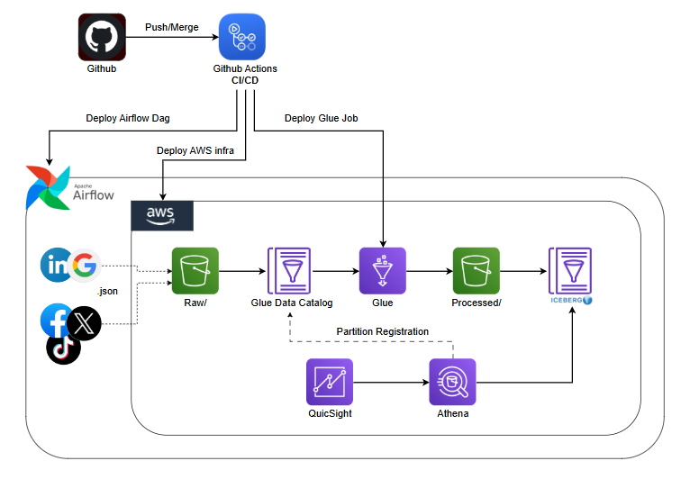
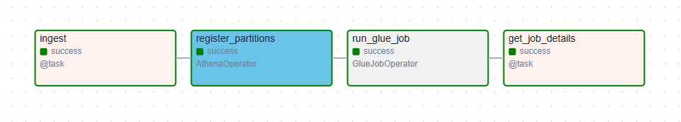

# Ad Campaign Lakehouse Pipeline

## Overview

This project implements a **batch-oriented lakehouse pipeline** using AWS managed services and Apache Iceberg. It demonstrates automated handling of heterogeneous ad campaign datasets with **varying schemas and structural inconsistencies** across source feeds, transforming them into curated, analytics-ready tables.

The pipeline ingests raw JSON files from source feeds with different schema conventions (cost-based vs. spend-based field naming), performs **automated schema reconciliation and metric standardization**, and stores normalized data in Apache Iceberg tables partitioned by event-date and optimized for analytical queries.

---

## Architecture



---
## Core Technologies

| Layer             | Technology            | Purpose                                                   |
| ----------------- | --------------------- | --------------------------------------------------------- |
| **Orchestration** | Apache Airflow        | Batch scheduling and workflow coordination                |
| **Processing**    | AWS Glue (PySpark)    | Distributed data transformation and schema reconciliation |
| **Storage**       | Amazon S3             | Object storage for raw and processed data                 |
| **Table Format**  | Apache Iceberg        | ACID-compliant lakehouse tables with upsert capability    |
| **Catalog**       | AWS Glue Data Catalog | Centralized metadata and table definitions                |
| **Query Engine**  | Amazon Athena         | SQL analytics on Iceberg tables                           |
| **IaC**           | AWS CloudFormation    | Infrastructure deployment and management                  |
| **CI/CD**         | GitHub Actions        | Automated testing and deployment                          |

---
## High-Level Flow

1. Airflow DAG triggers daily pipeline execution
2. Campaign data fetched from external Ad APIs
3. Raw JSON files uploaded to S3 via multipart upload with date partitions
4. Partition registered in Glue Data Catalog via Athena
5. Starts Glue PySpark job for data processing
6. Schema reconciliation, Metric standardization & enrichment
7. Handles late-arriving data with Upsert
8. Output written to Apache Iceberg tables in Parquet format, partitioned by event_date
9. Data queryable via Athena or consumed by QuickSight dashboards
10. Airflow manages task retries, SLA monitoring, and email notifications

---
## Key Features

- **Automated schema reconciliation**  
  Resolves structural inconsistencies across heterogeneous source feeds (cost vs. spend field naming, type mismatches, categorical standardization) without manual mapping.

- **Lakehouse architecture with Apache Iceberg**  
  ACID transactions, schema evolution, time-travel queries, and MERGE upserts for handling late-arriving data with snapshot isolation and partition pruning.

- **Late-arriving data reconciliation**  
  Tracks reconciliation attempts, maintains audit trail with reconciliation count and processing timestamps, and updates campaign metrics when delayed data arrives.

- **Environment-isolated infrastructure (Dev / Prod)**  
  Separate dev and production stacks with parameterized configurations and environment-specific resources enable safe development and controlled promotion to production.

- **Infrastructure as Code**  
  Complete CloudFormation templates for reproducible deployments with version-controlled parameter files and automated stack management.

- **CI/CD automation**  
  GitHub Actions workflows automate testing, validation, and deployment of infrastructure, Glue jobs, and Airflow DAGs across environments.

- **Efficient table maintenance**  
  Automated Iceberg optimization (compaction, snapshot retention, orphan file cleanup) to prevent small-file proliferation and metadata bloat.

- **Workflow orchestration with Apache Airflow**
  Airflow manages workflow dependencies with task-level retries, SLA monitoring, failure callbacks, and email notifications for operational reliability.

---
## Repository Structure

```
.
├── .github/
│   └── workflows/
│       ├── deploy-infra.yaml
│       ├── deploy-glue.yaml
│       └── deploy-airflow.yaml
│
├── infra/
│   ├── template.yaml
|   └── params/
|	    ├── dev.json
|	    └── production.json
│
├── scripts/
│   └── ad-glue-job.py
│
├── dags/
│   └── ad_campaign_pipeline.py
│
├── tests/
│   └── test_ad_campaign_pipeline.py
│
├── Architecture/
|   ├── architecture.png
│   └── dag.png
│
└── README.md
```


---
## DAG



